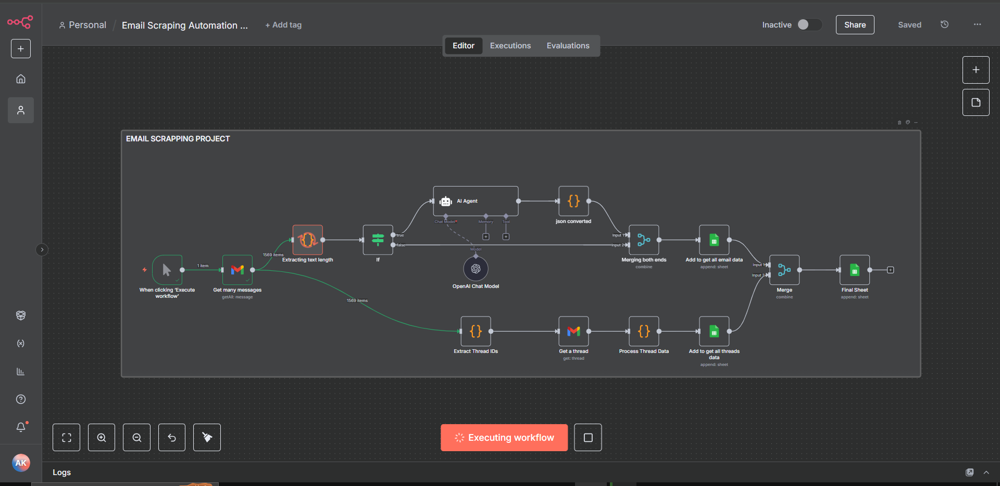
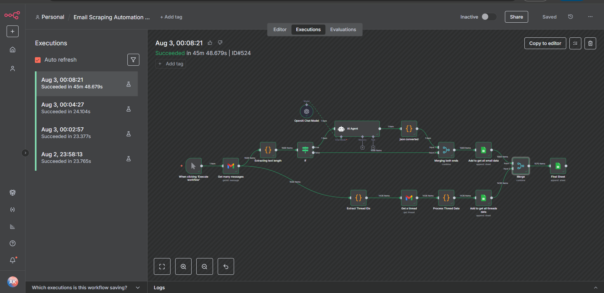
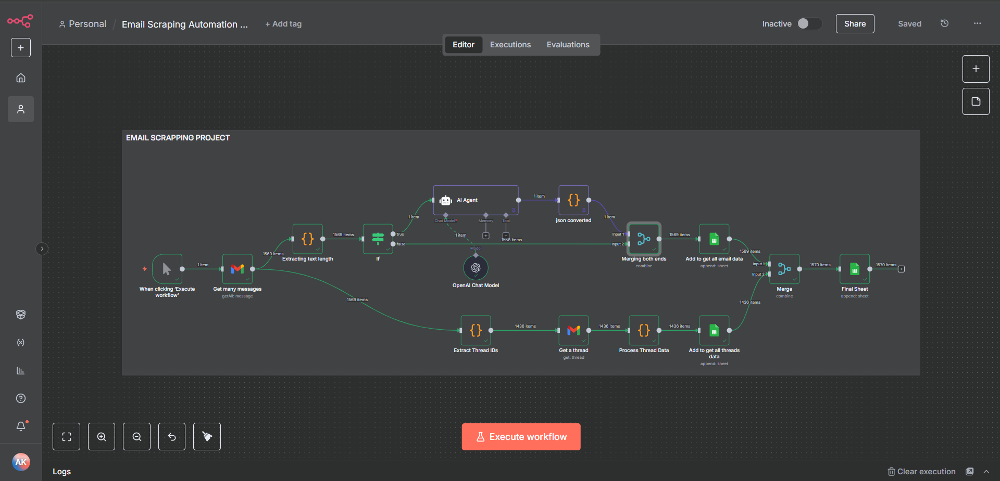

# AI-Powered Email Scraping & Summarization Automation

- **Full Name:** Muhammad Alber
- **Student ID:** su92-bscsm-f23-353
- **Section:** BSCS-6A

---

## 🚀 Overview

This repository contains a high-performance **n8n Automation Workflow** designed to streamline email processing. The system automatically scrapes incoming emails from a Gmail inbox, analyzes the content and length, processes entire email threads, and utilizes **OpenAI's Large Language Models (LLMs)** via **Langchain** to generate intelligent summaries of long email chains. The processed data, along with thread analytics and AI summaries, is automatically aggregated and logged into structured **Google Sheets** for reporting and business intelligence.

This project demonstrates strong capabilities in:
- **Workflow Automation & Orchestration (n8n)**
- **API Integrations** (Google Workspace, OpenAI)
- **Data Engineering & ETL** (Extract, Transform, Load)
- **AI Agent Integration** for Natural Language Processing

## 🏗 Technical Stack

- **n8n:** Core workflow automation platform.
- **Gmail API:** For extracting emails, thread IDs, and parsing message payloads.
- **Google Sheets API:** Serving as the structured database for final data aggregation.
- **OpenAI (gpt-4o-mini):** For intelligent text summarization.
- **Langchain:** Orchestrating the AI agent to extract structured JSON (Summarized body & Thread ID).
- **JavaScript (Node.js):** Custom code nodes for data transformation, header extraction, and length evaluation.

## 🔄 Workflow Architecture

The automation follows a parallel-processing approach:

1. **Trigger & Fetch:** The workflow initializes and fetches unread/inbox emails via the Gmail node.
2. **Text Analysis & Routing:** Custom JavaScript code evaluates the length of the email text. 
   - If the text is exceedingly long, it flags the email for AI summarization.
   - It also extracts unique Thread IDs to group conversations.
3. **AI Summarization Pipeline:** An AI Agent receives the email content with a strict prompt to summarize the thread focusing on key decisions and action items, returning structured JSON.
4. **Thread Processing Pipeline:** Concurrently, the workflow retrieves full thread data, combining messages (up to 500 per thread), calculating character counts, and extracting timestamps.
5. **Data Merge & Aggregation:** The AI summaries and the raw thread data are merged using the `Thread ID` as the primary key.
6. **Storage:** The final, enriched datasets are exported to targeted Google Sheets for analytics and record-keeping.

## 📂 Repository Structure

```text
n8n-Automations/
├── workflows/
│   ├── Email_Scraping_Automation_Org.json      # Main production workflow
│   ├── Email_Scraping_Automation_Testing.json  # Staging/Testing environment workflow
│   └── Development_Version.json                # Legacy/development iteration
├── assets/
│   ├── workflow-overview.png                   # High-level view of the n8n nodes
│   ├── successful-execution.png                # Execution logs and data flow
│   └── workflow-details.png                    # Detailed view of AI & Merge logic
├── samples/
│   └── output.json                             # Sample data output from the automation
└── README.md                                   # Project documentation
```

## 📸 Workflow Visuals

### 1. High-Level Workflow Overview
An architectural view of the n8n nodes working in harmony.


### 2. Successful Execution & Data Flow
Real-time execution logs demonstrating the successful parsing and routing of over 1,500 items.


### 3. AI Agent & Merge Logic Details
Close-up on the Langchain AI Agent processing text and merging endpoints before exporting to Google Sheets.


---

*This project highlights modern full-stack development practices, focusing on stability, efficient API pathing, and production-first automation design.*
